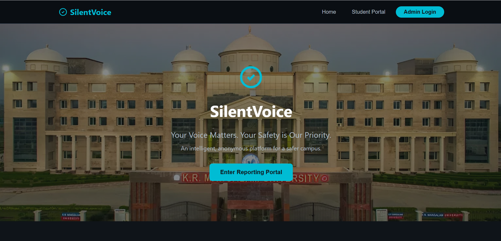
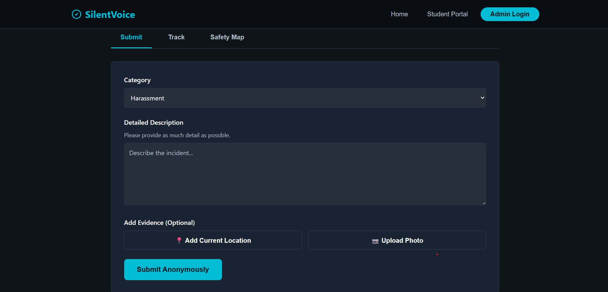
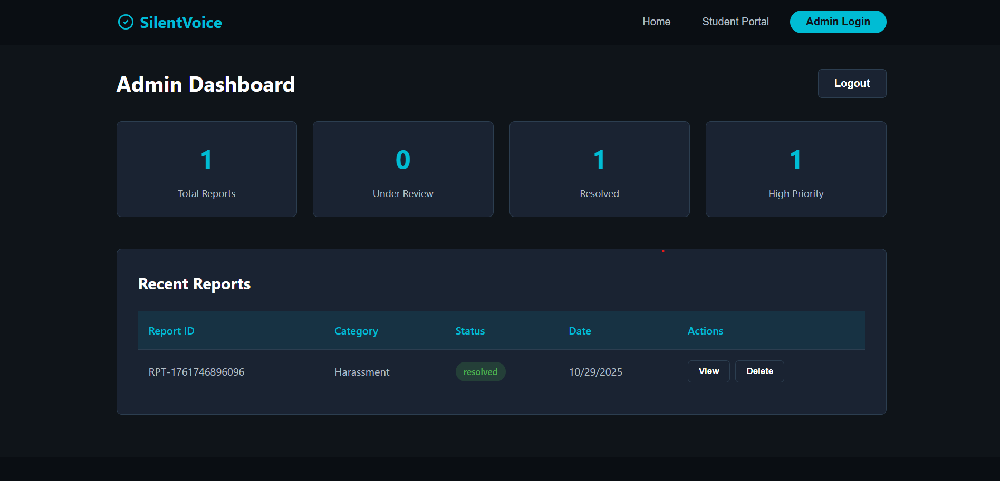

# 🛰️ Silent-Voice

Silent-Voice is a secure and intelligent **Web-Based Service Platform** built using **HTML, CSS, and JavaScript**.  
It allows users to submit requests with location tracking (Longitude & Latitude), while the **Admin Panel** receives, monitors, and manages user requests in real-time.

---

## ✨ Key Features

- 🌍 **Location Sharing**
  - Users upload Longitude & Latitude via browser-based geolocation
- 📝 **Request Submission**
  - Users can send service/issue requests to the admin
- 🛠️ **Admin Panel**
  - Admin can view, track, approve, and respond to user requests
- 🎨 **Modern Web UI**
  - Clean design using custom CSS
- 📊 **Real-Time Request Status**
  - Pending → Processing → Completed
- 📁 Efficient Data Handling Using JSON / Local Storage

---

## 🖼️ Screenshots

| User Home | Location Upload | Admin Dashboard |
|:---------:|:----------------:|:----------------:|
|  |  |  |


> 📌 Replace these placeholder images with your real screenshot URLs

---

## 🧩 Tech Stack

| Category | Technology Used |
|:--|:--|
| Frontend | HTML5, CSS3, JavaScript |
| Database / Storage | LocalStorage / JSON |
| Tracking | Browser Geolocation API |
| Deployment | GitHub Pages / Netlify |

---

## 📂 Project Structure

Silent-Voice/
├── assets/                      # Static resources
│   ├── css/                     # All stylesheets
│   ├── js/                      # JavaScript & logic files
│   └── images/                  # Icons, graphics & UI media
│
├── index.html                   # Main user homepage
├── location.html                # Capture GPS coordinates
├── status.html                  # Track submitted requests
│
├── admin-login.html             # Admin authentication page
├── admin.html                   # Manage and verify requests
│
└── README.md                    # Project documentation

---


---

## 🚀 How It Works

### ✅ User Side
1. Opens app
2. Submits personal details + request
3. Shares **current GPS location**
4. Can track request status anytime

### 🔑 Admin Side
1. Logs into the Admin Panel
2. Sees all request details
3. Updates request progress
4. User sees status updates instantly

---

## 📌 Installation

```bash
# Clone the repository
git clone https://github.com/deepakdotdevs/Silent-Voice.git

# Navigate to folder
cd Silent-Voice

# Run on live server (recommended)
Right-click -> "Open With Live Server"

---

## 🧑‍💻 Developer Info

**Deepak**  
B.Tech CSE | Web & App Developer  
K.R. Mangalam University  
📍 India  

 


